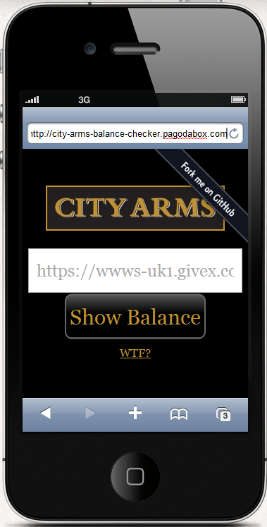
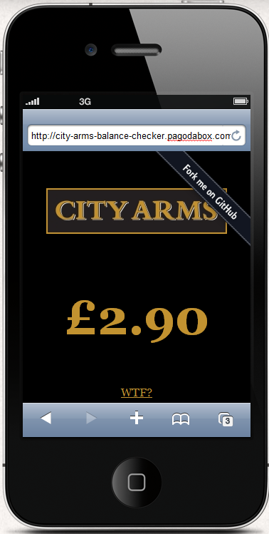

city-arms-balance-checker
=========================

A quick project created in [silex](http://silex.sensiolabs.org/) designed so you can quickly check your city arms card balance on your phone from the pub.

installation
=============

- Clone the repo
- Run php composer.phar install
- Make web/ the webroot

demo
=====

You can view the app at: [http://city-arms-balance-checker.herokuapp.com](http://city-arms-balance-checker.herokuapp.com)

contribution suggestions
=========================

- Improve the look (I am no designer!)
- Offer some suggestions on drinks you can afford, e.g. if you have a balance of £4 suggest you have enough for a Peroni
- Add some geolocation which knows if you are in the pub and goads you into buying a pint or something
- Find some way of incriminating tidy within this, perhaps if you get a high balance you unlock a tidy badge
